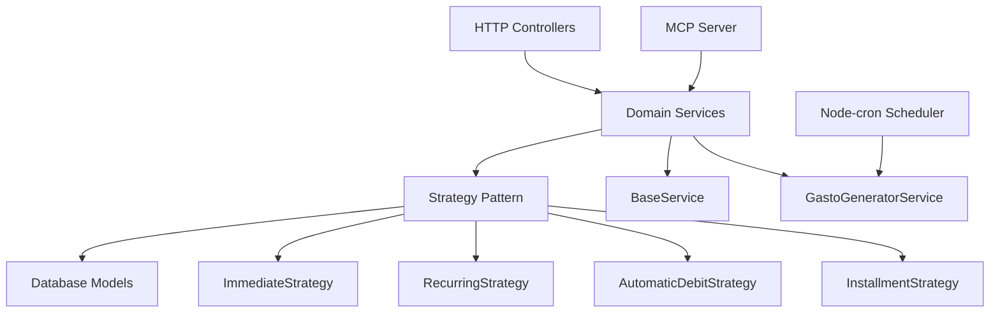

# 📚 Personal Finance API - Complete Documentation

> **Last Updated**: September 2025 - Post Strategy Pattern Migration
> **Architecture**: Strategy Pattern + BaseService + Clean Architecture

## 🎯 Quick Navigation

| 📁 Section | 📋 Description | 🔗 Links |
|-------------|-----------------|----------|
| **🏗️ Architecture** | Patterns, services, strategies | [Architecture Overview](./architecture/) |
| **🔌 API Reference** | Endpoints, schemas, examples | [API Documentation](./api/) |
| **🧪 Testing** | Test structure, MCP integration | [Testing Guide](./testing/) |
| **🤖 MCP Server** | Model Context Protocol setup | [MCP Guide](./testing/mcp-integration.md) |

## 🚀 What's New (September 2025)

### Major Architectural Modernization ✨

- **🎨 Strategy Pattern**: 5 specialized expense generation strategies
- **🔧 BaseService**: Eliminated 300+ lines of duplicate CRUD code
- **🧹 Clean Architecture**: SOLID principles implementation
- **🧪 Test Infrastructure**: Centralized testing with 41% service coverage
- **📊 Transaction Safety**: All operations use database transactions

## 🏗️ Architecture Overview



### 🎯 Core Components

1. **🎨 Strategy Pattern** - Expense generation from different sources
2. **🔧 Service Layer** - BaseService + Domain-specific services
3. **📊 Transaction Safety** - All operations use database transactions
4. **⏰ Scheduler** - Node-cron for automatic expense generation
5. **🤖 MCP Integration** - Model Context Protocol for external access

## 📋 Features

### ✅ Expense Management
- **One-time expenses** (gastos únicos) - Immediate generation
- **Recurring expenses** - Monthly/annual patterns with frequency control
- **Automatic debits** - Subscriptions with end dates
- **Installment purchases** - Credit card billing cycle aware

### ✅ Business Intelligence
- **Category system** (rent, groceries, transportation, etc.)
- **Importance levels** (essential, nice to have, dispensable)
- **Payment methods** (cash, debit, credit, transfer)
- **Credit card management** with closing and due dates

### ✅ Technical Excellence
- **RESTful API** with standardized responses
- **PostgreSQL** with Docker for consistency
- **Comprehensive validation** with Joi schemas
- **Structured logging** with Winston
- **Web interface** with Handlebars templates

## 🔄 Business Logic Highlights

### 💳 Credit Card Billing Cycle Logic
```javascript
// Installment purchases respect credit card billing cycles
if (paymentMethod === 'credit') {
  // Generate expense on due date, not purchase date
  nextExpenseDate = calculateDueDate(purchaseDate, card.diaVencimiento, card.diaCierre);
} else {
  // Immediate generation for cash/debit
  nextExpenseDate = purchaseDate;
}
```

### 🔄 Automatic Generation Pipeline
```javascript
// Daily scheduler (5:00 AM Argentina timezone)
const scheduledExpenses = [
  ...recurringExpenses.readyForToday(),
  ...automaticDebits.readyForToday(),
  ...installments.readyForToday()
];

// All generation uses Strategy Pattern
for (const expense of scheduledExpenses) {
  await strategy.generate(expense, transaction);
}
```

## 📊 API Endpoints Summary

| Endpoint | Method | Purpose | Status |
|----------|---------|---------|--------|
| `/api/gastos` | GET | List with filters & pagination | ✅ |
| `/api/gastos/summary` | GET | Analytics & summaries | ✅ |
| `/api/gastos/generate` | GET | Manual generation trigger | ✅ |
| `/api/gastos-unicos` | CRUD | One-time expense management | ✅ |
| `/api/compras` | CRUD | Purchase management | ✅ |
| `/api/gastos-recurrentes` | CRUD | Recurring expense management | ✅ |
| `/api/debitos-automaticos` | CRUD | Automatic debit management | ✅ |

## 🤖 MCP Server Integration

The application exposes a **Model Context Protocol (MCP)** server that provides:

### 🛠️ Available Tools
1. **`get_business_rules`** - Complete business logic documentation
2. **`get_api_endpoints`** - Real-time endpoint status and architecture info
3. **`get_database_schema`** - Schema with Strategy Pattern context
4. **`get_test_scenarios`** - Predefined test cases by category
5. **`execute_api_call`** - Direct API testing capability

### 🔧 Usage
```bash
# For Claude Code integration
npm run mcp:start

# For RestAssured and external tools
npm run mcp:http

# Development mode with auto-reload
npm run mcp:dev
```

## 🧪 Testing Strategy

### 📁 Test Structure
```
tests/
├── unit/              # Unit tests
│   ├── controllers/   # Controller tests
│   ├── services/      # Service tests (41% coverage)
│   └── strategies/    # Strategy tests (70% coverage)
├── integration/       # Integration tests
└── e2e/              # End-to-end tests
```

### 🎯 Key Test Suites
- **Services Basic Tests** - Instantiation and method validation
- **Integration Tests** - Services ↔ Strategies ↔ Database flow
- **Controller Tests** - HTTP layer validation
- **Strategy Tests** - Business logic validation

## 🚀 Getting Started

### Prerequisites
- Node.js 18+
- Docker Desktop
- PostgreSQL 15 (via Docker)

### Quick Start
```bash
# 1. Start database
npm run docker:up

# 2. Install dependencies
npm install

# 3. Seed database
npm run seed-db

# 4. Start application
npm run dev

# 5. Start MCP server (optional)
npm run mcp:http
```

### Verification
- **API**: http://localhost:3030
- **Swagger**: http://localhost:3030/api-docs
- **MCP Health**: http://localhost:3031/mcp/health

## 📈 Performance & Metrics

- **Code Quality**: 300+ lines of duplication eliminated
- **Architecture**: Strategy Pattern + BaseService implementation
- **Test Coverage**: Services 41%, Strategies 70%
- **Transaction Safety**: 100% of write operations
- **Database**: Argentina timezone handling (-03:00)
- **Logging**: Structured Winston logs with error tracking

## 🔮 Future Roadmap

1. **User Authentication & Management** (Next major feature)
2. **Advanced Analytics & Reporting**
3. **Mobile API Optimization**
4. **Real-time Notifications**
5. **IoC Container** for advanced dependency injection

---

## 📞 Support & Contributing

For questions about the architecture, API usage, or MCP integration, refer to the specific documentation sections above or use the MCP server tools for interactive exploration.

**Generated with Claude Code** 🤖